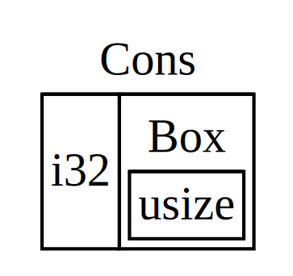

## Używanie `Box<T>` do wskazywania danych na stercie

Najprostszym inteligentnym wskaźnikiem jest *box*, którego typ jest zapisany
`Box<T>`. Boxy pozwalają na przechowywanie danych na stercie, a nie na stosie. To, co
pozostaje na stosie, to wskaźnik do danych sterty. Zapoznaj się z rozdziałem 4, aby
przejrzeć różnice między stosem a stertą.

Boxy nie mają narzutu wydajnościowego, poza przechowywaniem swoich danych na
stercie zamiast na stosie. Ale nie mają też wielu dodatkowych możliwości. Najczęściej będziesz ich używać w następujących sytuacjach:

* Gdy masz typ, którego rozmiar nie może być znany w czasie kompilacji i chcesz
użyć wartości tego typu w kontekście, który wymaga dokładnego rozmiaru
* Gdy masz dużą ilość danych i chcesz przenieść własność, ale
upewnić się, że dane nie zostaną skopiowane, gdy to zrobisz
* Gdy chcesz mieć własność wartości i zależy ci tylko na tym, aby był to typ, który
implementuje określoną cechę, a nie jest określonego typu

Pierwszą sytuację zademonstrujemy w sekcji [„Włączanie typów rekurencyjnych z
polami”](#enabling-recursive-types-with-boxes)<!-- ignore -->. W
drugim przypadku przeniesienie własności dużej ilości danych może zająć dużo czasu,
ponieważ dane są kopiowane na stosie. Aby poprawić wydajność w
tej sytuacji, możemy przechowywać dużą ilość danych na stercie w polu.
Następnie kopiowana jest tylko niewielka ilość danych wskaźnikowych na stosie,
podczas gdy dane, do których się odwołuje, pozostają w jednym miejscu na stercie. Trzeci przypadek jest
znany jako *obiekt cechy*, a rozdział 18 poświęca całą sekcję [„Używanie
obiektów cech, które pozwalają na wartości różnych typów,”][trait-objects]<!--
ignoruj ​​--> tylko temu tematowi. Więc to, czego się tutaj nauczysz, zastosujesz ponownie w
rozdziale 18!

### Używanie `Box<T>` do przechowywania danych na stercie

Zanim omówimy przypadek użycia pamięci sterty dla `Box<T>`, omówimy
składnię i sposób interakcji z wartościami przechowywanymi w `Box<T>`.

Listing 15-1 pokazuje, jak używać pola do przechowywania wartości `i32` na stercie:

<Listing number="15-1" file-name="src/main.rs" caption="Storing an `i32` value on the heap using a box">

```rust
{{#rustdoc_include ../listings/ch15-smart-pointers/listing-15-01/src/main.rs}}
```

</Listing>

Definiujemy zmienną `b`, aby miała wartość `Box` wskazującą na
wartość `5`, która jest przydzielona na stercie. Ten program wydrukuje `b = 5`; w
tym przypadku możemy uzyskać dostęp do danych w polu podobnie jak w przypadku, gdy te
dane znajdują się na stosie. Podobnie jak każda posiadana wartość, gdy pole wychodzi poza
zakres, tak jak `b` na końcu `main`, zostanie ono zwolnione. Zwolnienie następuje zarówno dla pola (przechowywanego na stosie), jak i dla danych, na które ono wskazuje (przechowywanych na stercie).

Umieszczanie pojedynczej wartości na stercie nie jest zbyt przydatne, więc nie będziesz zbyt często używać pól samych w ten sposób. Posiadanie wartości takich jak pojedyncze `i32` na
stosie, gdzie są domyślnie przechowywane, jest bardziej odpowiednie w większości
sytuacji. Przyjrzyjmy się przypadkowi, w którym pola pozwalają nam definiować typy, których nie moglibyśmy zdefiniować, gdybyśmy nie mieli pól.

### Włączanie typów rekurencyjnych za pomocą pól

Wartość *typu rekurencyjnego* może mieć inną wartość tego samego typu jako część
samej siebie. Typy rekurencyjne stanowią problem, ponieważ w czasie kompilacji Rust musi
wiedzieć, ile miejsca zajmuje typ. Jednak zagnieżdżanie wartości
typów rekurencyjnych mogłoby teoretycznie trwać w nieskończoność, więc Rust nie może wiedzieć, ile
miejsca potrzebuje wartość. Ponieważ pola mają znany rozmiar, możemy włączyć
typy rekurencyjne, wstawiając pole w definicji typu rekurencyjnego.

Jako przykład typu rekurencyjnego przyjrzyjmy się *liście wad*. Jest to typ danych
powszechnie występujący w językach programowania funkcyjnego. Typ listy wad,
który zdefiniujemy, jest prosty, z wyjątkiem rekurencji; dlatego
koncepcje w przykładzie, z którym będziemy pracować, będą przydatne za każdym razem, gdy znajdziesz się w
bardziej złożonych sytuacjach obejmujących typy rekurencyjne.

#### Więcej informacji o liście wad

*Lista wad* to struktura danych pochodząca z języka programowania Lisp
i jego dialektów, składająca się z zagnieżdżonych par i będąca wersją Lisp listy powiązanej. Jej nazwa pochodzi od funkcji `cons` (skrót od „construct function”) w Lisp, która konstruuje nową parę z dwóch argumentów. Poprzez
wywołanie `cons` dla pary składającej się z wartości i innej pary, możemy
konstruować listy wad składające się z par rekurencyjnych.

Na przykład, oto pseudokodowa reprezentacja listy wad zawierającej
listę 1, 2, 3 z każdą parą w nawiasach:

```tekst
(1, (2, (3, Nil)))
```

Każdy element listy wad zawiera dwa elementy: wartość bieżącego elementu
i następny element. Ostatni element na liście zawiera tylko wartość o nazwie `Nil`
bez następnego elementu. Lista wad jest generowana przez rekurencyjne wywołanie funkcji `cons`
. Kanoniczną nazwą oznaczającą przypadek bazowy rekurencji jest `Nil`.
Należy zauważyć, że nie jest to to samo, co koncepcja „null” lub „nil” w rozdziale 6,
co jest wartością nieprawidłową lub brakującą.

Lista wad nie jest powszechnie używaną strukturą danych w Rust. W większości przypadków,
gdy masz listę elementów w Rust, lepszym wyborem jest `Vec<T>`.
Inne, bardziej złożone rekurencyjne typy danych *są* przydatne w różnych sytuacjach,
ale zaczynając od listy wad w tym rozdziale, możemy zbadać, w jaki sposób pola
pozwalają nam zdefiniować rekurencyjny typ danych bez większego rozpraszania uwagi.

Listing 15-2 zawiera definicję wyliczeniową dla listy wad. Należy zauważyć, że ten kod
jeszcze się nie skompiluje, ponieważ typ `List` nie ma znanego rozmiaru, co
zademonstrujemy.
<Listing number="15-2" file-name="src/main.rs" caption="The first attempt at defining an enum to represent a cons list data structure of `i32` values">

```rust,ignore,does_not_compile
{{#rustdoc_include ../listings/ch15-smart-pointers/listing-15-02/src/main.rs:here}}
```

</Listing>

> Uwaga: Implementujemy listę cons, która zawiera tylko wartości `i32` na potrzeby
> tego przykładu. Moglibyśmy ją zaimplementować, używając typów generycznych, jak
> omówiliśmy w rozdziale 10, aby zdefiniować typ listy cons, który mógłby przechowywać wartości
> dowolnego typu.

Użycie typu `List` do przechowywania listy `1, 2, 3` wyglądałoby jak kod w
Listingu 15-3:

<Listing number="15-3" file-name="src/main.rs" caption="Using the `List` enum to store the list `1, 2, 3`">

```rust,ignore,does_not_compile
{{#rustdoc_include ../listings/ch15-smart-pointers/listing-15-03/src/main.rs:here}}
```

</Listing>

Pierwsza wartość `Cons` zawiera `1`, a kolejna wartość `List`. Ta wartość `List` jest
inną wartością `Cons` zawierającą `2` i inną wartość `List`. Ta wartość `List`
jest kolejną wartością `Cons` zawierającą `3` i wartość `List`, która jest ostatecznie
``Nil`, nierekurencyjną odmianą sygnalizującą koniec listy.

Jeśli spróbujemy skompilować kod w Liście 15-3, otrzymamy błąd pokazany w
Liście 15-4:

<Listing number="15-4" file-name="output.txt" caption="The error we get when attempting to define a recursive enum">

```console
{{#include ../listings/ch15-smart-pointers/listing-15-03/output.txt}}
```

</Listing>

Błąd pokazuje, że ten typ „ma nieskończony rozmiar”. Powodem jest to, że zdefiniowaliśmy
`List` z wariantem, który jest rekurencyjny: przechowuje inną wartość samego siebie
bezpośrednio. W rezultacie Rust nie może ustalić, ile miejsca potrzebuje do przechowywania wartości
`List`. Wyjaśnijmy, dlaczego otrzymujemy ten błąd. Najpierw przyjrzymy się, jak
Rust decyduje, ile miejsca potrzebuje do przechowywania wartości typu nierekurencyjnego.

#### Obliczanie rozmiaru typu nierekurencyjnego

Przypomnij sobie wyliczenie `Message`, które zdefiniowaliśmy w Liście 6-2, gdy omawialiśmy definicje wyliczeń w rozdziale 6:

```rust
{{#rustdoc_include ../listings/ch06-enums-and-pattern-matching/listing-06-02/src/main.rs:here}}
```

Aby określić, ile miejsca przydzielić dla wartości `Message`, Rust przechodzi
przez każdy z wariantów, aby zobaczyć, który wariant potrzebuje najwięcej miejsca. Rust
widzi, że `Message::Quit` nie potrzebuje żadnej przestrzeni, `Message::Move` potrzebuje wystarczająco dużo
miejsca, aby przechowywać dwie wartości `i32` itd. Ponieważ będzie
używany tylko jeden wariant, najwięcej miejsca, jakiego będzie potrzebowała wartość `Message`, to miejsce, którego potrzebowałaby do przechowywania
największego z jej wariantów.

Porównaj to z tym, co się dzieje, gdy Rust próbuje określić, ile miejsca potrzebuje
typ rekurencyjny, taki jak wyliczenie `List` w Liście 15-2. Kompilator zaczyna
od sprawdzenia wariantu `Cons`, który przechowuje wartość typu `i32` i wartość
typu `List`. Dlatego `Cons` potrzebuje ilości miejsca równej rozmiarowi
`i32` plus rozmiarowi `List`. Aby ustalić, ile pamięci potrzebuje typ `List`, kompilator sprawdza warianty, zaczynając od wariantu `Cons`. Wariant `Cons` przechowuje wartość typu `i32` i wartość typu
`List`, a proces ten jest kontynuowany w nieskończoność, jak pokazano na rysunku 15-1.


<span class="caption">Rysunek 15-1: Nieskończona `List` składająca się z nieskończonych wariantów
`Cons` variants</span>

#### Użycie `Box<T>` w celu uzyskania typu rekurencyjnego o znanym rozmiarze

Ponieważ Rust nie potrafi określić, ile miejsca przeznaczyć na typy definiowane rekurencyjnie, kompilator zgłasza błąd z następującą pomocną sugestią:

<!-- manual-regeneration
after doing automatic regeneration, look at listings/ch15-smart-pointers/listing-15-03/output.txt and copy the relevant line
-->

```text
help: insert some indirection (e.g., a `Box`, `Rc`, or `&`) to break the cycle
  |
2 |     Cons(i32, Box<List>),
  |               ++++    +
```

W tej sugestii „pośredniość” oznacza, że ​​zamiast przechowywać wartość
bezpośrednio, powinniśmy zmienić strukturę danych, aby przechowywać wartość pośrednio,
zamiast tego przechowując wskaźnik do wartości.

Ponieważ `Box<T>` jest wskaźnikiem, Rust zawsze wie, ile miejsca potrzebuje `Box<T>`: rozmiar wskaźnika nie zmienia się w zależności od ilości danych, na które wskazuje. Oznacza to, że możemy umieścić `Box<T>` wewnątrz wariantu `Cons` zamiast
bezpośrednio innej wartości `List`. `Box<T>` będzie wskazywać na następną wartość `List`, która będzie na stercie, a nie wewnątrz wariantu `Cons`.
Koncepcyjnie nadal mamy listę, utworzoną z list zawierających inne listy, ale
ta implementacja bardziej przypomina teraz umieszczanie elementów obok siebie,
a nie wewnątrz siebie.

Możemy zmienić definicję wyliczenia `List` w Liście 15-2 i użycie `List` w Liście 15-3 na kod w Liście 15-5, który zostanie skompilowany:

<Listing number="15-5" file-name="src/main.rs" caption="Definition of `List` that uses `Box<T>` in order to have a known size">

```rust
{{#rustdoc_include ../listings/ch15-smart-pointers/listing-15-05/src/main.rs}}
```

</Listing>

Wariant `Cons` wymaga rozmiaru `i32` plus miejsca na przechowywanie danych wskaźnika pola. Wariant `Nil` nie przechowuje żadnych wartości, więc potrzebuje mniej miejsca
niż wariant `Cons`. Teraz wiemy, że każda wartość `List` zajmie
rozmiar `i32` plus rozmiar danych wskaźnika pola. Używając pola,
przerwaliśmy nieskończony, rekurencyjny łańcuch, więc kompilator może ustalić rozmiar,
który potrzebuje do przechowywania wartości `List`. Rysunek 15-2 pokazuje, jak wygląda teraz wariant `Cons`.



<span class="caption">Rysunek 15-2: A `List` która nie jest nieskończenie duża, ponieważ `Cons` zawiera `Box`</span>

Pola zapewniają tylko pośrednictwo i przydział sterty; nie mają żadnych innych specjalnych możliwości, takich jak te, które zobaczymy w przypadku innych typów inteligentnych wskaźników. Nie mają również narzutu wydajności, jaki powodują te specjalne możliwości, więc mogą być przydatne w przypadkach takich jak lista wad, gdzie pośrednictwo jest jedyną potrzebną nam funkcją. Przyjrzymy się również większej liczbie przypadków użycia pól w rozdziale 18.

Typ `Box<T>` jest inteligentnym wskaźnikiem, ponieważ implementuje cechę `Deref`,
która pozwala traktować wartości `Box<T>` jak referencje. Gdy wartość `Box<T>`
wychodzi poza zakres, dane sterty, na które wskazuje pole, są również czyszczone ze względu na implementację cechy `Drop`. Te dwie cechy będą
jeszcze ważniejsze dla funkcjonalności zapewnianej przez inne typy inteligentnych wskaźników,
które omówimy w dalszej części tego rozdziału. Przyjrzyjmy się tym dwóm cechom
bardziej szczegółowo.

[trait-objects]: ch18-02-trait-objects.html#using-trait-objects-that-allow-for-values-of-different-types
