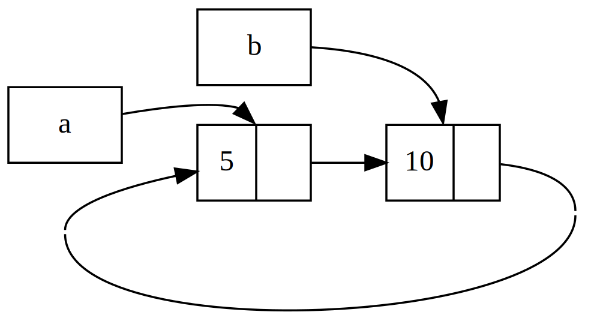

## Cykle odniesień mogą powodować wyciek pamięci

Gwarancje bezpieczeństwa pamięci Rust utrudniają, ale nie uniemożliwiają,
przypadkowe utworzenie pamięci, która nigdy nie jest czyszczona (znane jako *wyciek pamięci*).
Całkowite zapobieganie wyciekom pamięci nie jest jedną z gwarancji Rust, co oznacza, że
wycieki pamięci są bezpieczne dla pamięci w Rust. Możemy zobaczyć, że Rust pozwala na wycieki pamięci
poprzez użycie `Rc<T>` i `RefCell<T>`: możliwe jest tworzenie odniesień, w których
elementy odnoszą się do siebie nawzajem w cyklu. Powoduje to wycieki pamięci, ponieważ
liczba odniesień każdego elementu w cyklu nigdy nie osiągnie 0, a wartości
nigdy nie zostaną usunięte.

### Creating a Reference Cycle

Przyjrzyjmy się, jak może się zdarzyć cykl referencyjny i jak mu zapobiec,
zaczynając od definicji wyliczenia `List` i metody `tail` w Listing
15-25:
<Listing number="15-25" file-name="src/main.rs" caption="A cons list definition that holds a `RefCell<T>` so we can modify what a `Cons` variant is referring to">

```rust
{{#rustdoc_include ../listings/ch15-smart-pointers/listing-15-25/src/main.rs}}
```

</Listing>

Używamy innej wersji definicji `List` z Listingu 15-5.
Drugi element w wariancie `Cons` to teraz `RefCell<Rc<List>>`, co oznacza, że
zamiast mieć możliwość modyfikowania wartości `i32`, jak zrobiliśmy w Listingu
15-24, chcemy modyfikować wartość `List`, na którą wskazuje wariant `Cons`.
Dodajemy również metodę `tail`, aby ułatwić nam dostęp do
drugiego elementu, jeśli mamy wariant `Cons`.

W Listingu 15-26 dodajemy funkcję `main`, która używa definicji z
Listingu 15-25. Ten kod tworzy listę w `a` i listę w `b`, która wskazuje na
listę w `a`. Następnie modyfikuje listę w `a`, aby wskazywała na `b`, tworząc
cykl odniesienia. Po drodze znajdują się polecenia `println!` pokazujące, jakie są liczby odniesień w różnych punktach tego procesu.

<Listing number="15-26" file-name="src/main.rs" caption="Creating a reference cycle of two `List` values pointing to each other">

```rust
{{#rustdoc_include ../listings/ch15-smart-pointers/listing-15-26/src/main.rs:here}}
```

</Listing>

Tworzymy instancję `Rc<List>` zawierającą wartość `List` w zmiennej `a`
z początkową listą `5, Nil`. Następnie tworzymy instancję `Rc<List>` zawierającą
inną wartość `List` w zmiennej `b`, która zawiera wartość 10 i wskazuje
na listę w `a`.

Modyfikujemy `a` tak, aby wskazywała na `b` zamiast `Nil`, tworząc cykl. Robimy to,
używając metody `tail`, aby uzyskać odwołanie do `RefCell<Rc<List>>`
w `a`, które umieszczamy w zmiennej `link`. Następnie używamy metody `borrow_mut`
w `RefCell<Rc<List>>`, aby zmienić wartość wewnątrz z `Rc<List>`
który zawiera wartość `Nil` na `Rc<List>` w `b`.

Gdy uruchomimy ten kod, pozostawiając na chwilę zakomentowane ostatnie `println!`, otrzymamy następujący wynik:

```console
{{#include ../listings/ch15-smart-pointers/listing-15-26/output.txt}}
```

Liczba odwołań do instancji `Rc<List>` zarówno w `a`, jak i `b` wynosi 2 po
zmianie listy w `a` tak, aby wskazywała na `b`. Na końcu `main` Rust usuwa zmienną
b`, co zmniejsza liczbę odwołań do instancji `b` `Rc<List>`
z 2 do 1. Pamięć, którą `Rc<List>` ma na stercie, nie zostanie usunięta w tym
momencie, ponieważ jej liczba odwołań wynosi 1, a nie 0. Następnie Rust usuwa `a`, co
zmniejsza liczbę odwołań do instancji `a` `Rc<List>` z 2 do 1. Pamięć tej instancji również nie może zostać usunięta, ponieważ inna instancja
`Rc<List>` nadal się do niej odwołuje. Pamięć przydzielona liście
pozostanie niezebrana na zawsze. Aby zwizualizować ten cykl odwołań, utworzyliśmy
diagram na rysunku 15-4.



<span class="caption">Rysunek 15-4: Cykl referencyjny list `a` i `b`
wskazujących na siebie nawzajem</span>

Jeśli odkomentujesz ostatnie `println!` i uruchomisz program, Rust spróbuje
wydrukować ten cykl z `a` wskazującym na `b` wskazującym na `a` i tak dalej, aż do przepełnienia stosu.

W porównaniu z programem w świecie rzeczywistym, konsekwencje tworzenia cyklu referencyjnego
w tym przykładzie nie są bardzo poważne: zaraz po utworzeniu cyklu referencyjnego,
program się kończy. Jednak jeśli bardziej złożony program przydzieli dużo pamięci
w cyklu i będzie ją trzymał przez długi czas, program zużyje więcej pamięci,
niż będzie potrzebował i może przeciążyć system, powodując wyczerpanie
dostępnej pamięci.

Tworzenie cykli referencyjnych nie jest łatwe, ale nie jest też niemożliwe.
Jeśli masz wartości `RefCell<T>` zawierające wartości `Rc<T>` lub podobne zagnieżdżone
kombinacje typów z wewnętrzną zmiennością i zliczaniem odniesień, musisz
upewnić się, że nie tworzysz cykli; nie możesz polegać na Rust, aby je wyłapać.
Utworzenie cyklu odniesień byłoby błędem logicznym w programie, który powinieneś
zminimalizować za pomocą automatycznych testów, przeglądów kodu i innych praktyk programistycznych.

Innym rozwiązaniem pozwalającym uniknąć cykli odniesień jest reorganizacja struktur danych,
tak aby niektóre odniesienia wyrażały własność, a niektóre nie.
W rezultacie możesz mieć cykle składające się z niektórych relacji własności i
niektórych relacji niewłasności, a tylko relacje własności wpływają na to,
czy wartość może zostać pominięta. W Liście 15-25 zawsze chcemy, aby warianty `Cons`
posiadały swoją listę, więc reorganizacja struktury danych nie jest możliwa.
Przyjrzyjmy się przykładowi wykorzystującemu grafy składające się z węzłów nadrzędnych i podrzędnych, aby zobaczyć, kiedy relacje niebędące własnością są odpowiednim sposobem zapobiegania
cyklom odniesień.

### Preventing Reference Cycles: Turning an `Rc<T>` into a `Weak<T>`

Do tej pory wykazaliśmy, że wywołanie `Rc::clone` zwiększa
`strong_count` instancji `Rc<T>`, a instancja `Rc<T>` jest czyszczona
tylko wtedy, gdy jej `strong_count` wynosi 0. Możesz również utworzyć *słabe odwołanie* do
wartości w instancji `Rc<T>`, wywołując `Rc::downgrade` i przekazując
odwołanie do `Rc<T>`. Silne odwołania to sposób, w jaki możesz współdzielić własność
instancji `Rc<T>`. Słabe odwołania nie wyrażają relacji własności,
a ich liczba nie ma wpływu na to, kiedy instancja `Rc<T>` jest czyszczona. Nie spowodują one
cyklu odwołań, ponieważ każdy cykl obejmujący słabe odwołania
zostanie przerwany, gdy liczba silnych odwołań zaangażowanych wartości wyniesie 0.

Gdy wywołasz `Rc::downgrade`, otrzymasz inteligentny wskaźnik typu `Weak<T>`.
Zamiast zwiększać `strong_count` w instancji `Rc<T>` o 1, wywołanie
`Rc::downgrade` zwiększa `weak_count` o 1. Typ `Rc<T>` używa
`weak_count` do śledzenia liczby istniejących odniesień `Weak<T>`, podobnie jak
`strong_count`. Różnica polega na tym, że `weak_count` nie musi wynosić 0, aby instancja
`Rc<T>` została wyczyszczona.

Ponieważ wartość, do której odwołuje się `Weak<T>`, mogła zostać usunięta, aby
zrobić cokolwiek z wartością, na którą wskazuje `Weak<T>`, musisz się upewnić, że
wartość nadal istnieje. Zrób to, wywołując metodę `upgrade` w instancji `Weak<T>`,
co zwróci `Option<Rc<T>>`. Otrzymasz wynik `Some`
jeśli wartość `Rc<T>` nie została jeszcze usunięta i wynik `None` jeśli wartość
`Rc<T>` została usunięta. Ponieważ `upgrade` zwraca `Option<Rc<T>>`,
Rust zapewni, że przypadek `Some` i przypadek `None` zostaną obsłużone i
nie będzie nieprawidłowego wskaźnika.

Na przykład zamiast używać listy, której elementy wiedzą tylko o następnym elemencie, utworzymy drzewo, którego elementy wiedzą o swoich elementach podrzędnych *i*
swoich elementach nadrzędnych.

#### Creating a Tree Data Structure: a `Node` with Child Nodes

Na początek zbudujemy drzewo z węzłami, które wiedzą o swoich węzłach podrzędnych.
Utworzymy strukturę o nazwie `Node`, która będzie zawierać własną wartość `i32`, a także
odniesienia do wartości jej węzłów podrzędnych `Node`:

<span class="filename">Filename: src/main.rs</span>

```rust
{{#rustdoc_include ../listings/ch15-smart-pointers/listing-15-27/src/main.rs:here}}
```

Chcemy, aby `Node` posiadał swoje dzieci i chcemy dzielić się tym prawem własności ze
zmiennymi, abyśmy mogli uzyskać bezpośredni dostęp do każdego `Node` w drzewie. Aby to zrobić,
definiujemy elementy `Vec<T>` jako wartości typu `Rc<Node>`. Chcemy również
zmodyfikować, które węzły są dziećmi innego węzła, więc mamy `RefCell<T>` w
`children` wokół `Vec<Rc<Node>>`.

Następnie użyjemy naszej definicji struktury i utworzymy jedną instancję `Node` o nazwie
`leaf` z wartością 3 i bez dzieci, a także inną instancję o nazwie `branch`
z wartością 5 i `leaf` jako jednym z jej dzieci, jak pokazano na Liście 15-27:

<Listing number="15-27" file-name="src/main.rs" caption="Creating a `leaf` node with no children and a `branch` node with `leaf` as one of its children">

```rust
{{#rustdoc_include ../listings/ch15-smart-pointers/listing-15-27/src/main.rs:there}}
```

</Listing>

Klonujemy `Rc<Node>` w `leaf` i przechowujemy to w `branch`, co oznacza, że
`Node` w `leaf` ma teraz dwóch właścicieli: `leaf` i `branch`. Możemy przejść z
`branch` do `leaf` przez `branch.children`, ale nie ma sposobu, aby przejść z
`leaf` do `branch`. Powodem jest to, że `leaf` nie ma odniesienia do `branch` i
nie wie, że są one powiązane. Chcemy, aby `leaf` wiedział, że `branch` jest jego
rodzicem. To zrobimy później.

#### Adding a Reference from a Child to Its Parent

Aby węzeł potomny był świadomy swojego rodzica, musimy dodać pole `parent` do
naszej definicji struktury `Node`. Problem polega na ustaleniu, jaki powinien być typ
`parent`. Wiemy, że nie może zawierać `Rc<T>`, ponieważ
tworzyłoby to cykl odniesień z `leaf.parent` wskazującym na `branch` i
`branch.children` wskazującym na `leaf`, co spowodowałoby, że ich wartości `strong_count`
nigdy nie byłyby równe 0.

Myśląc o relacjach w inny sposób, węzeł nadrzędny powinien posiadać swoje
potomstwa: jeśli węzeł nadrzędny zostanie usunięty, jego węzły podrzędne również powinny zostać usunięte. Jednak węzeł podrzędny nie powinien posiadać swojego rodzica: jeśli usuniemy węzeł podrzędny, węzeł
podrzędny powinien nadal istnieć. To przypadek słabych odniesień!

Zamiast `Rc<T>`, użyjemy typu `parent` `Weak<T>`,
konkretnie `RefCell<Weak<Node>>`. Teraz nasza definicja struktury `Node` wygląda
tak:

<span class="filename">Filename: src/main.rs</span>

```rust
{{#rustdoc_include ../listings/ch15-smart-pointers/listing-15-28/src/main.rs:here}}
```

Węzeł będzie mógł odwoływać się do swojego węzła nadrzędnego, ale nie będzie właścicielem swojego węzła nadrzędnego.
W Liście 15-28 aktualizujemy `main`, aby użyć tej nowej definicji, dzięki czemu węzeł `leaf`
będzie miał sposób na odwoływanie się do swojego węzła nadrzędnego, `branch`:

<Listing number="15-28" file-name="src/main.rs" caption="A `leaf` node with a weak reference to its parent node `branch`">

```rust
{{#rustdoc_include ../listings/ch15-smart-pointers/listing-15-28/src/main.rs:there}}
```

</Listing>

Tworzenie węzła `leaf` wygląda podobnie do Listingu 15-27 z wyjątkiem
pola `parent`: `leaf` zaczyna bez rodzica, więc tworzymy nową,
pustą instancję odniesienia `Weak<Node>`.

W tym momencie, gdy próbujemy uzyskać odniesienie do rodzica `leaf` za pomocą
metody `upgrade`, otrzymujemy wartość `None`. Widzimy to w wynikach z
pierwszego polecenia `println!`:

```text
leaf parent = None
```

Gdy utworzymy węzeł `branch`, będzie on miał również nowe odniesienie `Weak<Node>`
w polu `parent`, ponieważ `branch` nie ma węzła nadrzędnego.
Nadal mamy `leaf` jako jedno z dzieci `branch`. Gdy mamy instancję
`Node` w `branch`, możemy zmodyfikować `leaf`, aby nadać mu odniesienie `Weak<Node>`
do jego rodzica. Używamy metody `borrow_mut` w
`RefCell<Weak<Node>>` w polu `parent` `leaf`, a następnie używamy funkcji
`Rc::downgrade`, aby utworzyć odniesienie `Weak<Node>` do `branch` z
`Rc<Node>` w `branch.`

Gdy ponownie wydrukujemy rodzica `leaf`, tym razem otrzymamy wariant `Some`
zawierający `branch`: teraz `leaf` może uzyskać dostęp do swojego rodzica! Kiedy drukujemy `leaf`,
unikamy również cyklu, który ostatecznie zakończył się przepełnieniem stosu, jak w
Listingu 15-26; odwołania `Weak<Node>` są drukowane jako `(Weak)`:

```text
leaf parent = Some(Node { value: 5, parent: RefCell { value: (Weak) },
children: RefCell { value: [Node { value: 3, parent: RefCell { value: (Weak) },
children: RefCell { value: [] } }] } })
```

Brak nieskończonego wyjścia wskazuje, że ten kod nie utworzył cyklu
odniesienia. Możemy to również stwierdzić, patrząc na wartości, które otrzymujemy z wywołania
`Rc::strong_count` i `Rc::weak_count`.

#### Visualizing Changes to `strong_count` and `weak_count`

Przyjrzyjmy się, jak wartości `strong_count` i `weak_count` instancji `Rc<Node>`
zmieniają się, tworząc nowy wewnętrzny zakres i przenosząc tworzenie
`branch` do tego zakresu. Dzięki temu możemy zobaczyć, co się dzieje, gdy `branch`
jest tworzony, a następnie usuwany, gdy wychodzi poza zakres. Modyfikacje są pokazane
w Liście 15-29:

<Listing number="15-29" file-name="src/main.rs" caption="Creating `branch` in an inner scope and examining strong and weak reference counts">

```rust
{{#rustdoc_include ../listings/ch15-smart-pointers/listing-15-29/src/main.rs:here}}
```

</Listing>

Po utworzeniu `leaf` jego `Rc<Node>` ma silny licznik 1 i słaby
licznik 0. W wewnętrznym zakresie tworzymy `branch` i kojarzymy go z
`leaf`, w którym momencie, gdy drukujemy liczniki, `Rc<Node>` w `branch`
będzie miał silny licznik 1 i słaby licznik 1 (dla `leaf.parent` wskazującego
na `branch` z `Weak<Node>`). Gdy drukujemy liczniki w `leaf`, zobaczymy,
że będzie miał silny licznik 2, ponieważ `branch` ma teraz klon
`Rc<Node>` `leaf` zapisany w `branch.children`, ale nadal będzie miał słaby
licznik 0.

Gdy wewnętrzny zakres się kończy, `branch` wychodzi poza zakres, a silny licznik
`Rc<Node>` zmniejsza się do 0, więc jego `Node` zostaje porzucony. Słaba liczba 1
z `leaf.parent` nie ma wpływu na to, czy `Node` zostanie usunięte, więc nie mamy żadnych wycieków pamięci!

Jeśli spróbujemy uzyskać dostęp do rodzica `leaf` po zakończeniu zakresu, ponownie otrzymamy
`None`. Pod koniec programu `Rc<Node>` w `leaf` ma silną liczbę 1 i słabą liczbę 0, ponieważ zmienna `leaf` jest teraz jedynym odniesieniem do `Rc<Node>`.

Cała logika zarządzająca liczbami i usuwaniem wartości jest wbudowana w
`Rc<T>` i `Weak<T>` oraz ich implementacje cechy `Drop`. Określając, że relacja między dzieckiem a jego rodzicem powinna być odniesieniem
`Weak<T>` w definicji `Node`, możesz sprawić, że węzły nadrzędne będą wskazywać na węzły podrzędne i odwrotnie, bez tworzenia cyklu odniesień
i wycieków pamięci.

## Summary

W tym rozdziale opisano, jak używać inteligentnych wskaźników, aby tworzyć inne gwarancje i
kompromisy niż te, które Rust domyślnie tworzy przy zwykłych odwołaniach. Typ
`Box<T>` ma znany rozmiar i wskazuje na dane przydzielone na stercie. Typ
`Rc<T>` śledzi liczbę odwołań do danych na stercie, tak aby dane mogły mieć wielu właścicieli. Typ `RefCell<T>` ze swoją wewnętrzną
zmiennością daje nam typ, którego możemy użyć, gdy potrzebujemy niezmiennego typu, ale
musimy zmienić wewnętrzną wartość tego typu; wymusza również reguły pożyczania w czasie wykonywania, a nie w czasie kompilacji.

Omówiono również cechy `Deref` i `Drop`, które umożliwiają wiele
funkcjonalności inteligentnych wskaźników. Przyjrzeliśmy się cyklom odwołań, które mogą powodować
wycieki pamięci i jak im zapobiegać, używając `Weak<T>`.

Jeśli ten rozdział wzbudził Twoje zainteresowanie i chcesz wdrożyć własne
inteligentne wskaźniki, sprawdź [„The Rustonomicon”][nomicon], aby uzyskać więcej przydatnych
informacji.

Następnie porozmawiamy o współbieżności w Rust. Dowiesz się nawet o kilku nowych
inteligentnych wskaźnikach.

[nomicon]: ../nomicon/index.html
