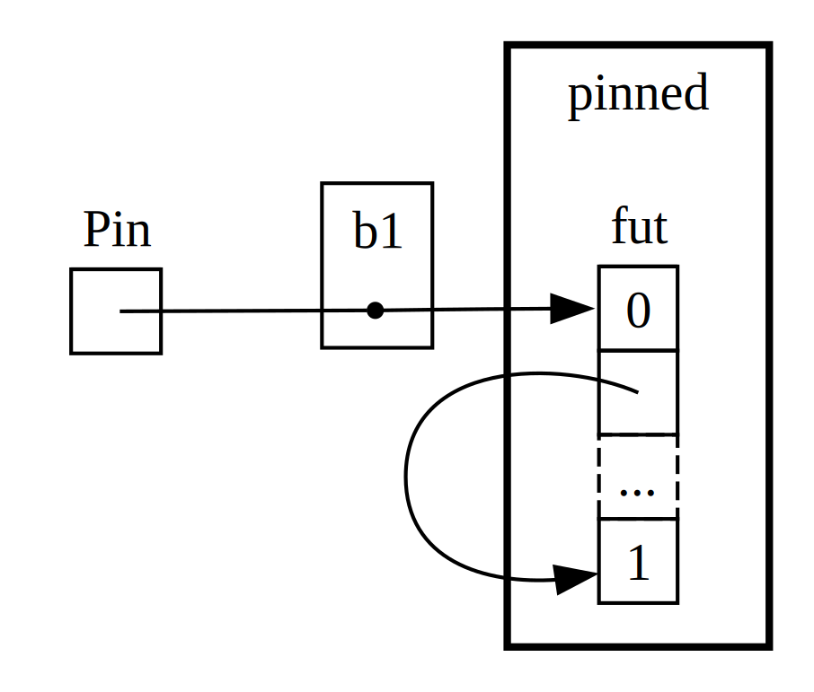

## Zagłębianie się w cechy asynchroniczne

W całym rozdziale używaliśmy cech `Future`, `Pin`, `Unpin`, `Stream` i
`StreamExt` na różne sposoby. Jak dotąd unikaliśmy jednak zbytniego zagłębiania się
w szczegóły ich działania lub tego, jak do siebie pasują. Przez większość czasu,
podczas codziennego pisania Rust, jest to w porządku. Czasami jednak trafisz
na sytuacje, w których zrozumienie kilku dodatkowych szczegółów ma znaczenie. W tej
sekcji zagłębimy się *wystarczająco* głębiej, aby pomóc w takich sytuacjach — jednocześnie
pozostawiając *naprawdę* głębokie nurkowanie na inną dokumentację!

### Przyszły

Back in [Futures i Składnia asynchroniczna][futures-syntax], we noted that `Future`
is a trait. Let’s start by taking a closer look at how it works. Here is how
Rust defines a `Future`:

```rust
use std::pin::Pin;
use std::task::{Context, Poll};

pub trait Future {
    type Output;

    fn poll(self: Pin<&mut Self>, cx: &mut Context<'_>) -> Poll<Self::Output>;
}
```

Ta definicja cechy obejmuje wiele nowych typów, a także składnię, której nie widzieliśmy wcześniej, więc przejrzyjmy definicję kawałek po kawałku.

Po pierwsze, skojarzony typ `Output` `Future` mówi, do czego rozwiązuje się przyszłość.
Jest to analogiczne do skojarzonego typu `Item` dla cechy `Iterator`.
Po drugie, `Future` ma również metodę `poll`, która przyjmuje specjalne odniesienie `Pin`
dla swojego parametru `self` i zmienne odniesienie do typu `Context`,
i zwraca `Poll<Self::Output>`. Porozmawiamy trochę więcej o `Pin` i
`Context` później w tej sekcji. Na razie skupmy się na tym, co metoda zwraca,
typ `Poll`:

```rust
enum Poll<T> {
    Ready(T),
    Pending,
}
```

Ten typ `Poll` jest podobny do `Option`: ma jedną odmianę, która ma wartość
(`Ready(T)`), i jedną, która jej nie ma (`Pending`). Oznacza to jednak coś zupełnie innego! Wariant `Pending` wskazuje, że przyszłość ma jeszcze
pracę do wykonania, więc osoba wywołująca będzie musiała sprawdzić ponownie później. Wariant `Ready`
oznacza, że ​​`Future` zakończyło swoją pracę, a wartość `T` jest
dostępna.

> Uwaga: W przypadku większości przyszłości osoba wywołująca nie powinna ponownie wywoływać `poll` po tym, jak
> przyszłość zwróci `Ready`. Wiele przyszłości wpadnie w panikę, jeśli zostanie ponownie odpytane po
> staniu się gotowym! Przyszłości, które można bezpiecznie ponownie odpytać, będą o tym wyraźnie informować w swojej
> dokumentacji. Jest to podobne do zachowania `Iterator::next`!

Pod maską, gdy widzisz kod, który używa `await`, Rust kompiluje go do kodu,
który wywołuje `poll`. Jeśli spojrzysz z powrotem na Listing 17-4, gdzie wydrukowaliśmy
tytuł strony dla pojedynczego adresu URL po jego rozwiązaniu, Rust kompiluje go do czegoś
podobnego (choć nie do końca) do tego:

```rust,ignore
match page_title(url).poll() {
    Ready(page_title) => match page_title {
        Some(title) => println!("The title for {url} was {title}"),
        None => println!("{url} had no title"),
    }
    Pending => {
        // But what goes here?
    }
}
```

Co powinniśmy zrobić, gdy `Future` jest wciąż `Pending`? Potrzebujemy sposobu, aby spróbować
ponownie… i ponownie, i ponownie, aż przyszłość będzie w końcu gotowa. Innymi słowy,
pętla:

```rust,ignore
let mut page_title_fut = page_title(url);
loop {
    match page_title_fut.poll() {
        Ready(value) => match page_title {
            Some(title) => println!("The title for {url} was {title}"),
            None => println!("{url} had no title"),
        }
        Pending => {
            // continue
        }
    }
}
```

Gdyby Rust skompilował go dokładnie do tego kodu, każde `await` byłoby
blokujące — dokładnie odwrotnie niż chcieliśmy! Zamiast tego Rust musi
upewnić się, że pętla może przekazać kontrolę czemuś, co może wstrzymać pracę
nad tą przyszłością i pracować nad innymi przyszłościami, a następnie ponownie sprawdzić tę. To
„coś” jest asynchronicznym środowiskiem wykonawczym, a ta praca nad harmonogramem i koordynacją jest
jednym z głównych zadań środowiska wykonawczego.

Przypomnij sobie nasz opis (w sekcji [Counting][counting]) oczekiwania na
`rx.recv`. Wywołanie `recv` zwraca `Future`, a oczekiwanie na nie sprawdza je. W naszej
pierwszej dyskusji zauważyliśmy, że środowisko wykonawcze wstrzyma przyszłość, dopóki nie będzie
gotowe na `Some(message)` lub `None`, gdy kanał zostanie zamknięty. Dzięki naszemu
głębszemu zrozumieniu `Future`, a konkretnie `Future::poll`, możemy
zobaczyć, jak to działa. Środowisko wykonawcze wie, że przyszłość nie jest gotowa, gdy
zwraca `Poll::Pending`. Z drugiej strony, środowisko wykonawcze wie, że przyszłość jest gotowa i
przesuwa ją do przodu, gdy `poll` zwraca `Poll::Ready(Some(message))` lub
`Poll::Ready(None)`.

Dokładne szczegóły tego, jak środowisko wykonawcze to robi, wykraczają poza to, co omówimy nawet w tej
głębokiej sekcji. Kluczem jest tutaj dostrzeżenie podstawowej mechaniki przyszłości: środowisko wykonawcze *sonduje* każdą przyszłość, za którą jest odpowiedzialne, usypiając ją, gdy
jeszcze nie jest gotowa.

### Przypinanie i cechy przypinania i odpinania

Kiedy wprowadziliśmy pomysł przypinania podczas pracy nad Listingiem 17-17, natknęliśmy się na bardzo paskudny komunikat o błędzie. Oto jego istotna część:

<!-- manual-regeneration
cd listings/ch17-async-await/listing-17-17
cargo build
copy *only* the final `error` block from the errors
-->

```text
error[E0277]: `{async block@src/main.rs:8:23: 20:10}` cannot be unpinned
  --> src/main.rs:46:33
   |
46 |         trpl::join_all(futures).await;
   |                                 ^^^^^ the trait `Unpin` is not implemented for `{async block@src/main.rs:8:23: 20:10}`, which is required by `Box<{async block@src/main.rs:8:23: 20:10}>: std::future::Future`
   |
   = note: consider using the `pin!` macro
           consider using `Box::pin` if you need to access the pinned value outside of the current scope
   = note: required for `Box<{async block@src/main.rs:8:23: 20:10}>` to implement `std::future::Future`
note: required by a bound in `JoinAll`
  --> /Users/chris/.cargo/registry/src/index.crates.io-6f17d22bba15001f/futures-util-0.3.30/src/future/join_all.rs:29:8
   |
27 | pub struct JoinAll<F>
   |            ------- required by a bound in this struct
28 | where
29 |     F: Future,
   |        ^^^^^^ required by this bound in `JoinAll`

Some errors have detailed explanations: E0277, E0308.
For more information about an error, try `rustc --explain E0277`.
```

Gdy uważnie przeczytamy ten komunikat o błędzie, nie tylko powie nam, że musimy
przypiąć wartości, ale także dlaczego przypinanie jest wymagane. Funkcja `trpl::join_all`
zwraca strukturę o nazwie `JoinAll`. Ta struktura jest generyczna w stosunku do typu
`F`, który jest ograniczony do implementacji cechy `Future`. Bezpośrednie oczekiwanie na
przyszłość za pomocą `await` przypina przyszłość niejawnie. Dlatego nie musimy używać
`pin!` wszędzie tam, gdzie chcemy oczekiwać na przyszłość.

Jednak tutaj nie oczekujemy bezpośrednio na przyszłość. Zamiast tego konstruujemy nową
przyszłość, `JoinAll`, przekazując zbiór przyszłości do funkcji `join_all`
. Sygnatura dla `join_all` wymaga, aby typ
elementów w kolekcji implementował cechę `Future`, a `Box<T>` implementuje `Future` tylko
jeśli `T`, które obejmuje, jest przyszłością implementującą cechę
`Unpin`.

To dużo! Ale możemy to zrozumieć, jeśli zagłębimy się trochę bardziej w to, jak działa typ
`Future`, w szczególności w kwestii *przypinania*.

Przyjrzyjmy się ponownie definicji `Future`:

```rust
use std::pin::Pin;
use std::task::{Context, Poll};

pub trait Future {
    type Output;

    // Required method
    fn poll(self: Pin<&mut Self>, cx: &mut Context<'_>) -> Poll<Self::Output>;
}
```

Parametr `cx` i jego typ `Context` są kluczem do tego, jak środowisko wykonawcze faktycznie
wie, kiedy sprawdzić daną przyszłość, będąc jednocześnie leniwym. Szczegóły tego, jak
to działa, wykraczają jednak poza zakres tego rozdziału: zazwyczaj musisz się tym martwić tylko podczas pisania niestandardowej implementacji `Future`.

Zamiast tego skupimy się na typie dla `self`. To pierwszy raz, kiedy widzimy
metodę, w której `self` ma adnotację typu. Adnotacja typu dla `self` jest
podobna do adnotacji typu dla innych parametrów funkcji, z dwiema kluczowymi
różnicami. Po pierwsze, gdy określamy typ `self` w ten sposób,
mówimy Rustowi, jaki typ musi mieć `self`, aby wywołać tę metodę. Po drugie, adnotacja typu dla `self` nie może być po prostu dowolnym typem. Może to być tylko typ,
w którym zaimplementowano metodę, odwołanie lub inteligentny wskaźnik do tego typu,
lub `Pin` opakowujący odwołanie do tego typu. Więcej na temat tej składni dowiemy się w
rozdziale 18. Na razie wystarczy wiedzieć, że jeśli chcemy sondować przyszłość (aby
sprawdzić, czy jest ona `Pending` lub `Ready(Output)`), potrzebujemy zmiennego odwołania
do typu, które jest opakowane w `Pin`.

`Pin` jest typem opakowującym. Pod pewnymi względami jest podobny do `Box`, `Rc` i
innych inteligentnych typów wskaźników, które widzieliśmy w rozdziale 15, które również opakowują inne typy.
Jednak w przeciwieństwie do nich `Pin` działa tylko z *typami wskaźników*, takimi jak odwołania
(`&` i `&mut`) i inteligentnymi wskaźnikami (`Box`, `Rc` itd.). Dokładniej rzecz ujmując,
`Pin` działa z typami, które implementują cechy `Deref` lub `DerefMut`, które
omówiliśmy w rozdziale 15. Możesz jednak traktować to ograniczenie jako równoważne
pracy tylko ze wskaźnikami, ponieważ implementacja `Deref` lub `DerefMut`
oznacza, że ​​Twój typ zachowuje się podobnie do typu wskaźnika. `Pin` nie jest również wskaźnikiem
samym w sobie i nie ma żadnego własnego zachowania, tak jak `Rc` i `Arc`
z liczeniem odniesień. Jest to po prostu narzędzie, którego kompilator może użyć do utrzymania
odpowiednich gwarancji, poprzez opakowywanie wskaźników w typ.

Pamiętając, że `await` jest implementowane w kategoriach wywołań `poll`, zaczyna to
wyjaśniać komunikat o błędzie, który widzieliśmy powyżej — ale był on w kategoriach `Unpin`, a nie
`Pin`. Czym więc dokładnie są `Pin` i `Unpin`, jak się ze sobą wiążą i dlaczego
`Future` potrzebuje `self`, aby być w typie `Pin`, aby wywołać `poll`?

W [Nasz pierwszy program asynchroniczny][first-async] opisaliśmy, jak seria punktów
oczekiwania w przyszłości jest kompilowana do maszyny stanowej — i zauważyliśmy, jak kompilator
pomaga upewnić się, że maszyna stanowa przestrzega wszystkich normalnych reguł Rusta dotyczących
bezpieczeństwa, w tym pożyczania i własności. Aby to zadziałało, Rust sprawdza, jakie
dane są potrzebne między każdym punktem oczekiwania a następnym punktem oczekiwania lub końcem
bloku asynchronicznego. Następnie tworzy odpowiednią odmianę w tworzonej przez siebie maszynie stanowej. Każda odmiana uzyskuje potrzebny dostęp do danych, które zostaną wykorzystane w
tej sekcji kodu źródłowego, czy to poprzez przejęcie własności tych danych, czy też poprzez
uzyskanie zmiennego lub niezmiennego odwołania do nich.

Jak dotąd wszystko jest w porządku: jeśli coś pójdzie nie tak z własnością lub odwołaniami w
danym bloku asynchronicznym, program sprawdzający pożyczenie nas o tym poinformuje. Kiedy chcemy przesunąć
przyszłość odpowiadającą temu blokowi — na przykład przenieść go do `Vec`, aby przekazać do
`join_all`, tak jak zrobiliśmy to z powrotem — sprawy stają się trudniejsze.

Kiedy przenosimy przyszłość — czy to poprzez wciśnięcie do struktury danych, aby użyć jej jako
iteratora z `join_all`, czy zwrócenie ich z funkcji — to w rzeczywistości oznacza
przesunięcie maszyny stanów, którą Rust dla nas tworzy. I w przeciwieństwie do większości innych typów w
Rust, przyszłości tworzone przez Rust dla bloków asynchronicznych mogą skończyć się odwołaniami do
samych siebie w polach dowolnej danej odmiany, jak na Rysunku 17-4 (uproszczona ilustracja, która pomoże ci zrozumieć ideę, zamiast zagłębiać się w to,
co często jest dość skomplikowane).

<figure>


<figcaption>Figure 17-4: A self-referential data type.</figcaption>

</figure>

Domyślnie jednak każdy obiekt, który ma odniesienie do samego siebie, jest niebezpieczny do
przeniesienia, ponieważ odniesienia zawsze wskazują na rzeczywisty adres pamięci rzeczy,
do której się odnoszą. Jeśli przeniesiesz samą strukturę danych, te wewnętrzne odniesienia
pozostaną wskazujące na starą lokalizację. Jednak ta lokalizacja pamięci jest teraz
nieprawidłowa. Po pierwsze, jej wartość nie zostanie zaktualizowana, gdy wprowadzisz zmiany w
strukturze danych. Po drugie — i co ważniejsze! — komputer może teraz
ponownie wykorzystać tę pamięć do innych rzeczy! Później możesz skończyć na odczytywaniu zupełnie
niezwiązanych danych.

<figure>


<figcaption>Rysunek 17-5: Niebezpieczny wynik przenoszenia typu danych samoodnoszącego się.</figcaption>

</figure>

W zasadzie kompilator Rust mógłby próbować aktualizować każde odwołanie do obiektu,
za każdym razem, gdy jest on przenoszony. To potencjalnie wiązałoby się z dużym obciążeniem wydajności,
zwłaszcza biorąc pod uwagę, że może istnieć cała sieć odwołań, które wymagają
aktualizacji. Z drugiej strony, gdybyśmy mogli upewnić się, że struktura danych, o której mowa, *nie jest przenoszona w pamięci*, nie musielibyśmy aktualizować żadnych odwołań.
To jest dokładnie to, czego wymaga sprawdzanie pożyczania w Rust: nie można przenieść elementu,
który ma jakiekolwiek aktywne odwołania do niego, używając bezpiecznego kodu.

`Pin` opiera się na tym, aby dać nam dokładną gwarancję, której potrzebujemy. Kiedy *przypinamy*
wartość, opakowując wskaźnik do tej wartości w `Pin`, nie może ona już się przesuwać. Tak więc,
jeśli masz `Pin<Box<SomeType>>`, w rzeczywistości przypinasz wartość `SomeType`, *nie*
wskaźnik `Box`. Ilustruje to Rysunek 17-6:
<figure>



<figcaption>Rysunek 17-6: Przypinanie „Pola” wskazującego na typ przyszłości odnoszący się do samego siebie.</figcaption>

</figure>

W rzeczywistości wskaźnik `Box` może się nadal swobodnie poruszać. Pamiętaj: zależy nam na tym, aby
dane, do których się odwołujemy, pozostały na swoim miejscu. Jeśli
wskaźnik się porusza, ale dane, na które wskazuje, znajdują się w tym samym miejscu, jak na
rysunku 17-7, nie ma potencjalnego problemu. (Jak można to zrobić za pomocą `Pin`
otaczającego `Box`, to więcej, niż omówimy w tej konkretnej dyskusji,
ale byłoby to dobre ćwiczenie! Jeśli przyjrzysz się dokumentacji typów,
a także modułowi `std::pin`, możesz być w stanie ustalić, jak to zrobić.) Kluczem jest to, że sam typ samoodniesieniowy nie może się poruszać, ponieważ
jest nadal przypięty.

<figure>


<figcaption>Rysunek 17-7: Przesuwanie pola wskazującego na typ przyszłości odnoszący się do samego siebie.</figcaption>

</figure>

Jednak większość typów można bezpiecznie przenosić, nawet jeśli znajdują się za wskaźnikiem `Pin`. Musimy pomyśleć o przypinaniu tylko wtedy, gdy elementy mają
wewnętrzne odwołania. Wartości prymitywne, takie jak liczby i wartości logiczne, nie mają
żadnych wewnętrznych odwołań, więc są oczywiście bezpieczne. Podobnie jak większość typów, z którymi normalnie pracujesz w Rust. Na przykład `Vec` nie ma żadnych wewnętrznych odwołań, których potrzebuje, aby być aktualizowanym w ten sposób, więc możesz je przenosić
bez obaw. Jeśli masz `Pin<Vec<String>>`, musisz zrobić wszystko
za pośrednictwem bezpiecznych, ale restrykcyjnych interfejsów API udostępnianych przez `Pin`, nawet jeśli
`Vec<String>` zawsze można bezpiecznie przenosić, jeśli nie ma do niego innych odwołań. Potrzebujemy sposobu, aby powiedzieć kompilatorowi, że w takich przypadkach można przenosić elementy. W tym celu mamy `Unpin`.

`Unpin` jest cechą znacznika, podobną do cech `Send` i `Sync`, które widzieliśmy w
rozdziale 16. Przypomnijmy, że cechy znacznika nie mają własnej funkcjonalności. Istnieją one tylko po to, aby powiedzieć kompilatorowi, że można bezpiecznie używać typu, który implementuje
daną cechę w określonym kontekście. `Unpin` informuje kompilator, że dany
typ *nie* musi podtrzymywać żadnych szczególnych gwarancji dotyczących tego, czy wartość, o której mowa, może zostać przeniesiona.

Podobnie jak w przypadku `Send` i `Sync`, kompilator implementuje `Unpin` automatycznie
dla wszystkich typów, dla których może udowodnić, że jest to bezpieczne. Szczególnym przypadkiem, podobnym do
`Send` i `Sync`, jest przypadek, w którym `Unpin` *nie* jest zaimplementowane dla typu.
Notacja dla tego jest `impl !Unpin for SomeType`, gdzie `SomeType` jest
nazwą typu, który *musi* podtrzymywać te gwarancje, aby był bezpieczny, kiedy wskaźnik do tego typu jest używany w `Pin`.

Innymi słowy, są dwie rzeczy, o których należy pamiętać w związku
pomiędzy `Pin` i `Unpin`. Po pierwsze, `Unpin` jest „normalnym” przypadkiem, a `!Unpin` jest
przypadkiem szczególnym. Po drugie, to, czy typ implementuje `Unpin` czy `!Unpin` *tylko*
ma znaczenie, gdy używa się przypiętego wskaźnika do tego typu, takiego jak `Pin<&mut SomeType>`.

Aby to ukonkretnić, pomyśl o `String`: ma długość i znaki Unicode,
które go tworzą. Możemy owinąć `String` w `Pin`, jak pokazano na Rysunku
17-8. Jednak `String` automatycznie implementuje `Unpin`, tak samo jak większość innych typów w Rust.

<figure>


<figcaption>Rysunek 17-8: Przypinanie ciągu znaków, z linią przerywaną wskazującą, że ciąg znaków implementuje cechę `Unpin` więc nie jest przypięty.
</figcaption>

</figure>

W rezultacie możemy robić rzeczy, które byłyby nielegalne, gdyby `String` implementował zamiast tego
`!Unpin`, takie jak zastępowanie jednego ciągu innym w dokładnie tym samym
miejscu w pamięci, co na rysunku 17-9. Nie narusza to kontraktu `Pin`,
ponieważ `String` nie ma wewnętrznych odniesień, które sprawiałyby, że jego przenoszenie jest niebezpieczne!
To właśnie dlatego implementuje `Unpin`, a nie `!Unpin`.

<figure>


<figcaption>Rysunek 17-9: Zastępowanie ciągu znaków zupełnie innym ciągiem znaków w pamięci.</figcaption>

</figure>

Teraz wiemy już wystarczająco dużo, aby zrozumieć błędy zgłoszone dla tego wywołania `join_all`
z Listingu 17-17. Początkowo próbowaliśmy przenieść futures wytworzone przez
bloki asynchroniczne do `Vec<Box<dyn Future<Output = ()>>>`, ale jak widzieliśmy,
te futures mogą mieć wewnętrzne odwołania, więc nie implementują `Unpin`.
Muszą zostać przypięte, a następnie możemy przekazać typ `Pin` do `Vec`,
mając pewność, że podstawowe dane w futures *nie* zostaną przeniesione.

`Pin` i `Unpin` są ważne głównie przy budowaniu bibliotek niższego poziomu lub
przy budowaniu samego środowiska wykonawczego, a nie przy codziennym kodzie Rust.
Gdy jednak zobaczysz te cechy w komunikatach o błędach, będziesz miał lepsze
pojęcie, jak naprawić kod!

> Uwaga: Ta kombinacja `Pin` i `Unpin` pozwala na bezpieczne zaimplementowanie w Rust całej klasy złożonych
> typów, które w innym przypadku byłyby trudne do zaimplementowania, ponieważ
> są samoodniesieniowe. Typy wymagające `Pin` pojawiają się *najczęściej*
> w asynchronicznym Rust, ale możesz — bardzo rzadko! — zobaczyć je również w innych kontekstach.
>
> Szczegóły działania `Pin` i `Unpin` oraz reguły, których muszą
> przestrzegać, są szeroko omówione w dokumentacji API dla `std::pin`, więc
> jeśli chcesz je lepiej zrozumieć, to jest to świetne miejsce na początek.
>
> Jeśli chcesz zrozumieć, jak wszystko działa „pod maską” jeszcze bardziej
> szczegółowo, oficjalna książka [_Programowanie asynchroniczne w Rust_][async-book]
> obejmuje:
>
> - [Rozdział 2: Pod maską: wykonywanie przyszłych zadań i zadań][under-the-hood]
> - [Rozdział 4: Przypinanie][pinning]

### Cecha strumienia

Teraz, gdy lepiej rozumiemy cechy `Future`, `Pin` i `Unpin`,
możemy skupić się na cesze `Stream`. Jak opisano w sekcji
wprowadzającej strumienie, strumienie są podobne do asynchronicznych iteratorów. W przeciwieństwie do
`Iterator` i `Future`, w chwili pisania tego tekstu nie ma definicji cechy `Stream` w
standardowej bibliotece, ale *istnieje* bardzo powszechna
definicja ze skrzyni `futures` używanej w całym ekosystemie.

Przeanalizujmy definicje cech `Iterator` i `Future`, abyśmy mogli
zbudować obraz tego, jak mogłaby wyglądać cecha `Stream`, która je łączy. Z
`Iterator` mamy pomysł na sekwencję: jej metoda `next` zapewnia
`Option<Self::Item>`. Z `Future` mamy pomysł gotowości w czasie:
jego metoda `poll` dostarcza `Poll<Self::Output>`. Aby przedstawić sekwencję
elementów, które stają się gotowe w czasie, definiujemy cechę `Stream`, która łączy te
cechy:

```rust
use std::pin::Pin;
use std::task::{Context, Poll};

trait Stream {
    type Item;

    fn poll_next(
        self: Pin<&mut Self>,
        cx: &mut Context<'_>
    ) -> Poll<Option<Self::Item>>;
}
```

Cecha `Stream` definiuje skojarzony typ `Item` dla typu elementów
wytworzonych przez strumień. Jest to podobne do `Iterator`: może ich być od zera do
wielu, w przeciwieństwie do `Future`, gdzie zawsze istnieje jedno `Output`
(nawet jeśli jest to typ jednostki `()`).

`Stream` definiuje również metodę pobierania tych elementów. Nazywamy ją `poll_next`, aby
wyraźnie zaznaczyć, że sonduje w ten sam sposób, w jaki robi to `Future::poll` i generuje
sekwencję elementów w ten sam sposób, w jaki robi to `Iterator::next`. Jej typ zwracany
łączy `Poll` z `Option`. Zewnętrznym typem jest `Poll`, ponieważ musi
być sprawdzany pod kątem gotowości, tak jak w przypadku future. Wewnętrznym typem jest `Option`,
ponieważ musi sygnalizować, czy jest więcej wiadomości, tak jak robi to iterator.

Coś bardzo podobnego prawdopodobnie zostanie ustandaryzowane jako część standardowej biblioteki Rust. Tymczasem jest to część zestawu narzędzi większości środowisk wykonawczych,
więc możesz na tym polegać, a wszystko, co omówimy poniżej, powinno mieć zastosowanie!

W przykładzie, który widzieliśmy w sekcji o strumieniowaniu, nie użyliśmy jednak
`poll_next` *ani* `Stream`, ale zamiast tego użyliśmy `next` i `StreamExt`. Oczywiście *moglibyśmy*
pracować bezpośrednio w ramach API `poll_next`, ręcznie pisząc nasze własne maszyny stanowe `Stream`,
tak jak *moglibyśmy* pracować z futures bezpośrednio za pośrednictwem
ich metody `poll`. Jednak używanie `await` jest o wiele przyjemniejsze, więc cecha `StreamExt`
dostarcza metodę `next`, więc możemy to zrobić.

```rust
{{#rustdoc_include ../listings/ch17-async-await/no-listing-stream-ext/src/lib.rs:here}}
```

<!--
TODO: zaktualizuj to, jeśli/kiedy tokio/etc. zaktualizuje swój MSRV i przejdzie na używanie funkcji asynchronicznych
w cechach, ponieważ ich brak jest powodem, dla którego jeszcze tego nie mają.
-->

> Uwaga: Rzeczywista definicja, której użyliśmy wcześniej w tym rozdziale, wygląda nieco inaczej
> niż ta, ponieważ obsługuje wersje Rust, które jeszcze nie
> obsługiwały używania funkcji asynchronicznych w cechach. W rezultacie wygląda to tak:
>
> ```rust,ignore
> fn next(&mut self) -> Next<'_, Self> where Self: Unpin;
> ```
>
> Ten typ `Next` jest `strukturą` implementującą `Future` i umożliwiającą
> nazwanie czasu życia odwołania do `self` za pomocą `Next<'_, Self>`, tak aby
> `await` mogło działać z tą metodą!

Cecha `StreamExt` jest również domem dla wszystkich interesujących metod dostępnych
do użycia ze strumieniami. `StreamExt` jest automatycznie implementowany dla każdego typu,
który implementuje `Stream`, ale te cechy są definiowane oddzielnie, tak aby
społeczność mogła iterować po cesze podstawowej niezależnie od wygodnych
API.

W wersji `StreamExt` używanej w pakiecie `trpl` cecha nie tylko
definiuje metodę `next`, ale także dostarcza implementację `next`, która
poprawnie obsługuje szczegóły wywołania `Stream::poll_next`. Oznacza to, że
nawet gdy musisz napisać własny typ danych strumieniowych, *wystarczy*, że
zaimplementujesz `Stream`, a następnie każdy, kto używa Twojego typu danych, będzie mógł automatycznie używać `StreamExt` i jego metod.

[futures-syntax]: ch17-01-futures-and-syntax.html
[counting]: ch17-02-concurrency-with-async.html
[async-book]: https://rust-lang.github.io/async-book/
[under-the-hood]: https://rust-lang.github.io/async-book/02_execution/01_chapter.html
[pinning]: https://rust-lang.github.io/async-book/04_pinning/01_chapter.html
[first-async]: ch17-01-futures-and-syntax.html#our-first-async-program

To wszystko, co omówimy w szczegółach niższego poziomu na temat tych cech. Podsumowując, rozważmy, jak przyszłości (w tym strumienie), zadania i wątki pasują do siebie!
